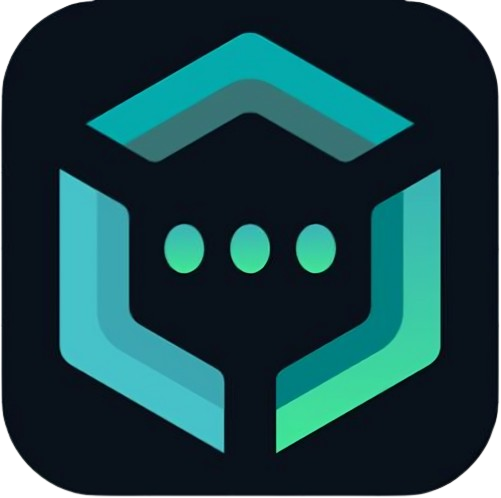
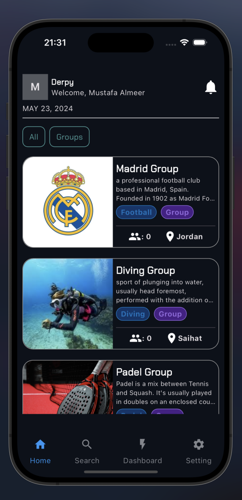
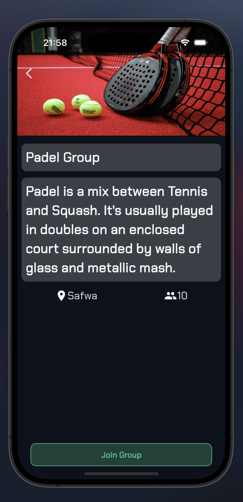
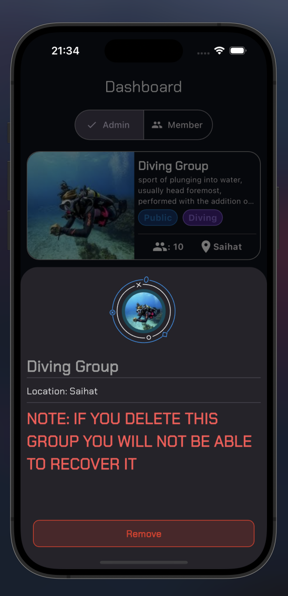
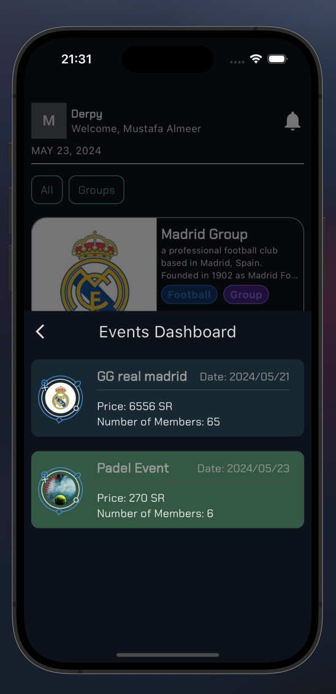

# Derby Mobile



## Introduction

Derby App is a groundbreaking platform designed to revolutionize sports connectivity in Saudi Arabia. With its user-friendly interface and robust features, the app enables sports enthusiasts to effortlessly create, join, and organize events, connect with like-minded individuals, and foster vibrant sports communities. Join us as we unveil the Derby App and explore its potential to transform the sports landscape in the kingdom.

## Technologies Used

-   **Technologies and Frameworks:**
    -   Dart
    -   Flutter
    -   Supabase
    -   Google Cloud

## Features

-   Create and organize sports events
-   Join events and connect with other sports enthusiasts
-   Create and join groups
-   Community building features

## Home Page



## Join Group



## Remove Group



## Event Dashboard



## Installation

To get started with the Derby App, follow these steps:

1. Clone the repository:
    ```bash
    git clone https://github.com/your-username/derby-app.git
    ```
2. Navigate to the project directory:
    ```bash
    cd derby-app
    ```
3. Install the dependencies:
    ```bash
    flutter pub get
    ```

## Usage

To run the app on your local machine:

1. Ensure you have a device connected or an emulator running.
2. Use the following command to start the app:
    ```bash
    flutter run
    ```

## Contact

For any inquiries or feedback, please contact us at [m.almeer.swe@gmail.com](mailto:email@example.com).
